# EcomerceFront

Este e-comerce es un proyecto personal donde implemneto mis conocimientos y se valido las compras con el API de epayco y despues de su validancion se hace la actualizacion del stock del producto

 - Conexion a base datos MySQL
 - Autenticacion de Usuarios
 - Jwt Security - Rol de ADMIN y USER
 - Productos - Incluye CRUD<
 - Categorias - Incluye CRUD
 - Carritod de compras  por Cliente
 - Compra y creacion de la orden Unica
 - Conexion con la API epayco para validad compra
 - Confrimacion de compra y actualizacion de stock del producto

# Tecnologias

- autenticacion con JWT
- Back con Spring Boot java
- Front con Angular y Tailwind css
- Conexion API de epayco

## Imagenes

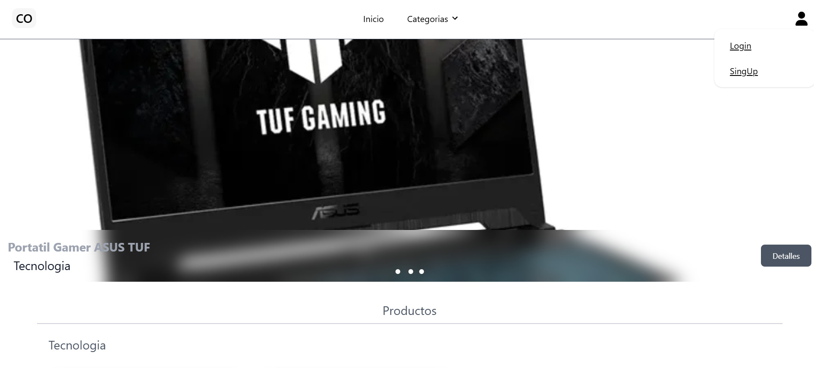

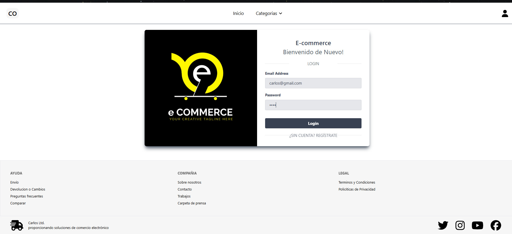

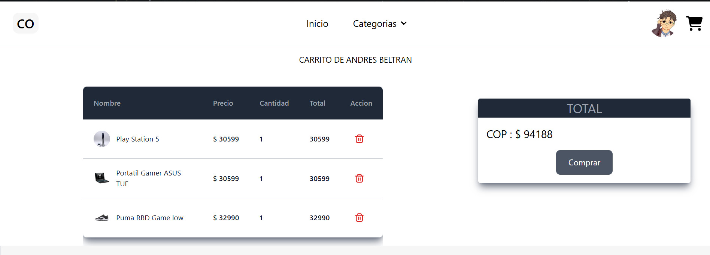

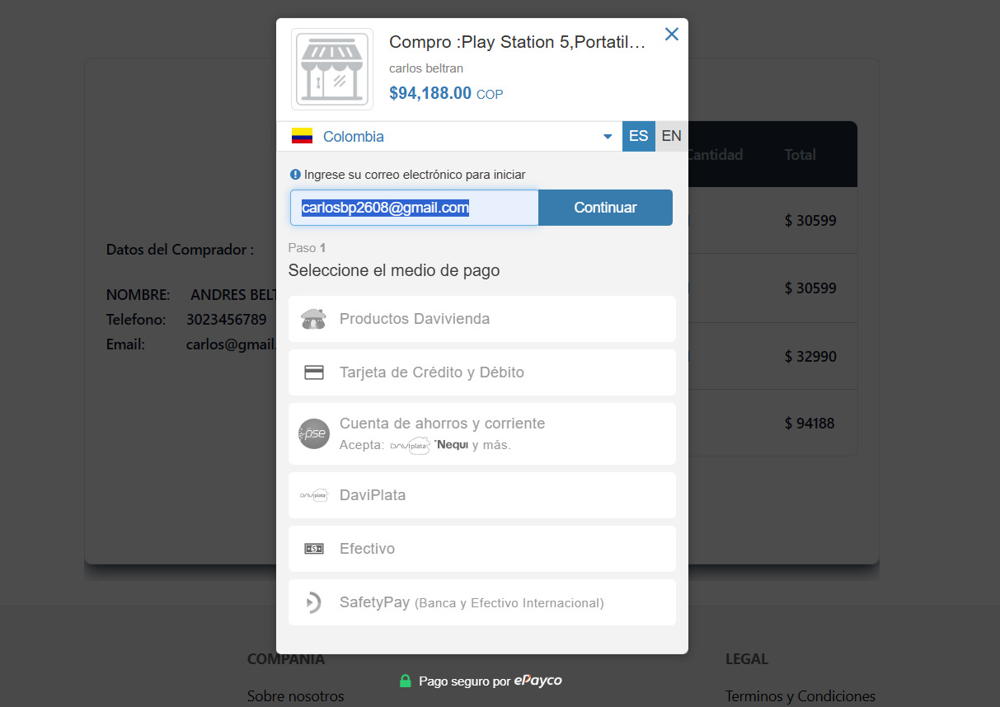
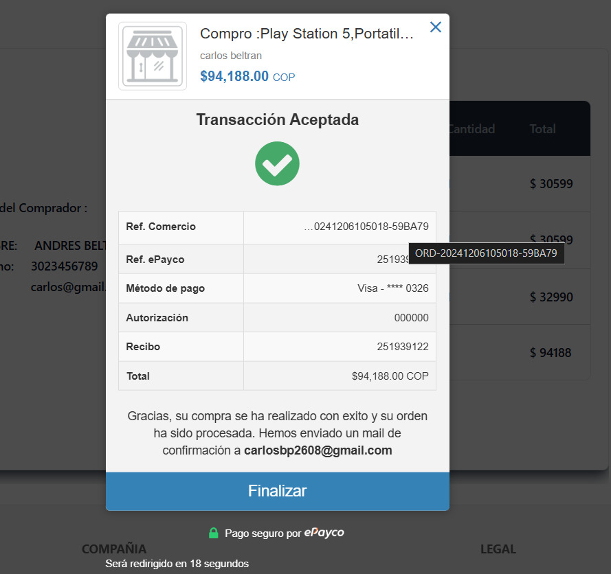
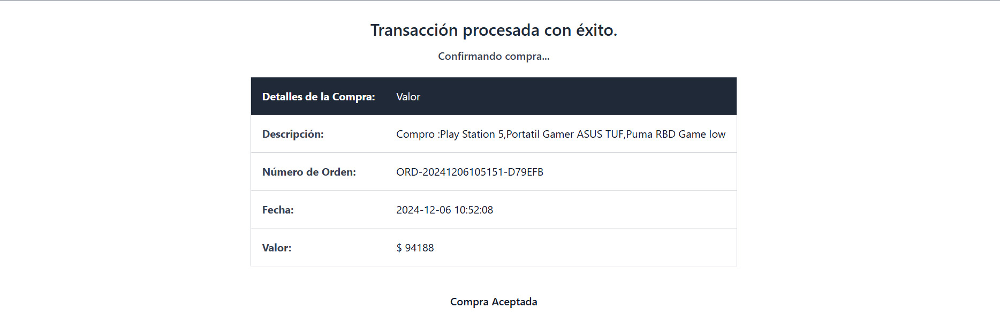
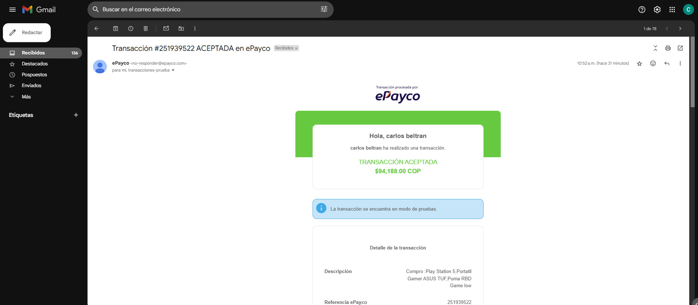
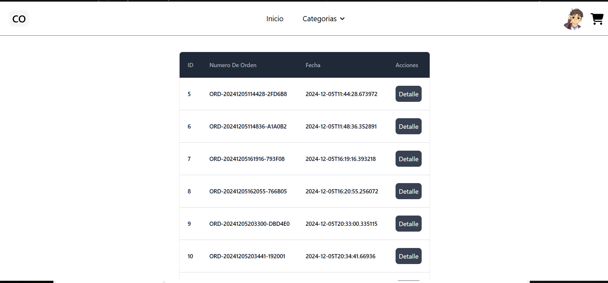
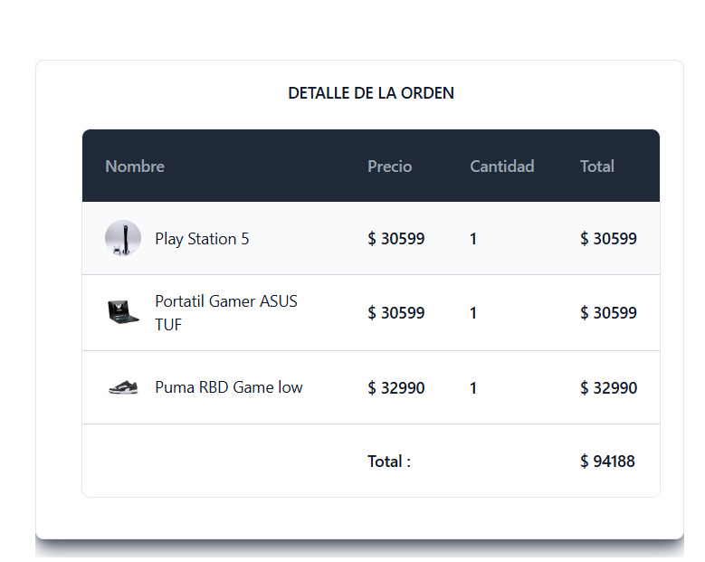

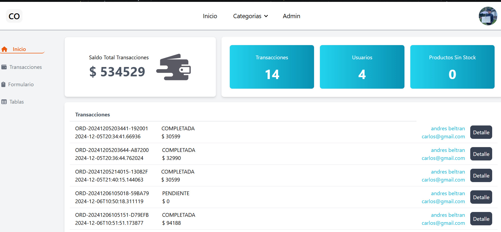
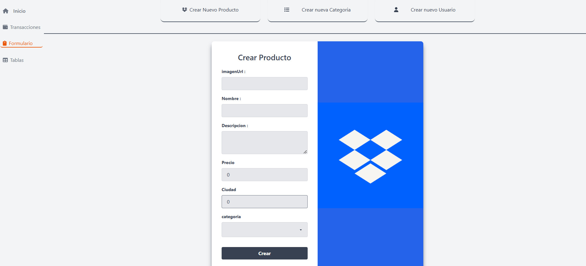
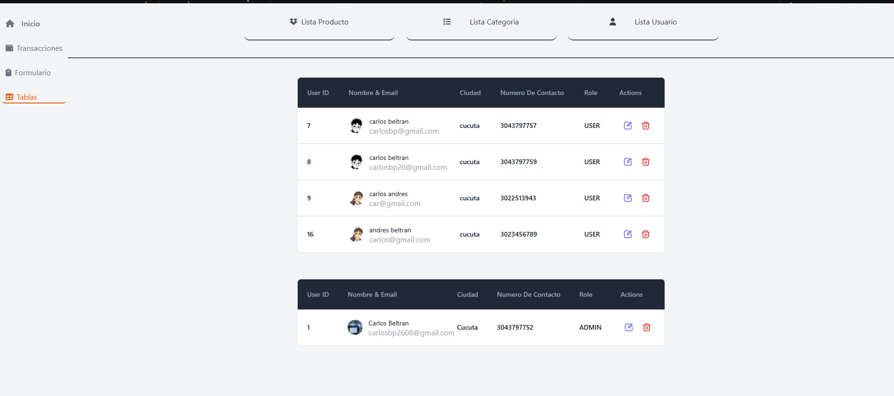
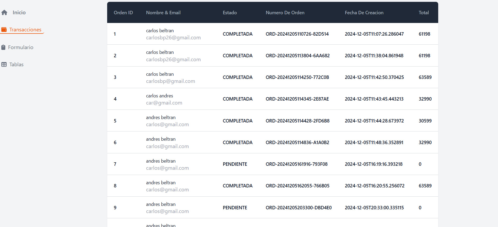

## Running unit tests

Run `ng test` to execute the unit tests via [Karma](https://karma-runner.github.io).

## Running end-to-end tests

Run `ng e2e` to execute the end-to-end tests via a platform of your choice. To use this command, you need to first add a package that implements end-to-end testing capabilities.

## Further help

To get more help on the Angular CLI use `ng help` or go check out the [Angular CLI Overview and Command Reference](https://angular.dev/tools/cli) page.
